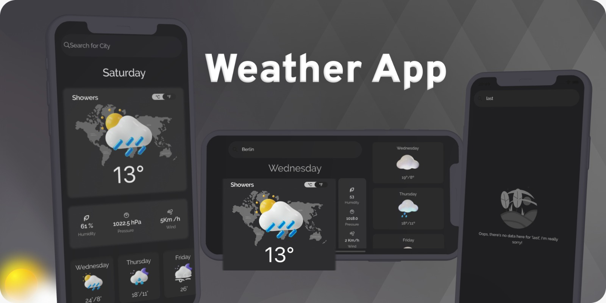

# Weather App

A Flutter app for the weather forecasting


## How to run 

**Step 1:**

Download or clone this repo by using the link below:

```
https://github.com/osamaasifoak/weatherapp
```

**Step 2:**

Go to project root and execute the following command in console to get the required dependencies: 

```
flutter pub get 
```

## Task to achieve

* Create a minimal UI.
* Get weather data from API.
* Handle error.
* Pull to refresh
* Centigrade to Farenhite conversion or vise versa.
* Handle UI in portrait and landscape mode.
* Update weather states on user selection.

## Libraries
* `Provder for state management`: I used Provider because it is easy to understand and it doesn’t use much code. It also uses concepts that are applicable in every other approach. And the things we need to do in this app we can easily accomplish through the `Provider`.
* `DIO for network calls`: I usually use `DIO` for dealing with API calls because it gives us an opportunity to use intercepters and the configuration is too handy. 

## Project files structure
* In this project I'm using MVVM architecture.
### `lib/main.dart`

Here the app sets up objects it needs to track state. It builds
a `MultiProvider` to provide object at once to widgets further down the tree. The `WeatherViewModel` instance is provided using a `ChangeNotifierProvider`

### `lib/components/*`
Here we provide shared widgets that is going to be used in multiple screens

### `lib/constants/*`
In `lib/constants` we defined our app strings, color and theme

### `lib/models/*`
These classes are responsible for data parsing and representation. 

### `lib/view_model/data/*`

This directory contains the provider classes that are provided in `main.dart`. These classes
represent the app state.

Here in this app. I create the weather_view_model which is responsible for the following things
1. It will get the data from API and handle the error states also if something happens during the call.
2. It will set the initial state of app.
3. It changes the states on API result.
4. It changes the state of temperature unit.

### `lib/view_model/repository/remote/*`
This directory contains all network calls as per module

### `lib/views/*`

This directory contains widgets used to construct the the screen of the app. 

### `lib/screens/weather/*`

This directory contains widgets used to construct the specicific screen of the app. And the widget has access to the current state of the Weather via Provider.of

### `lib/screens/weather/components/*`

These components are only available for the weather view. In which we can access the current state and reflect changes on UI via `Consumer`.


